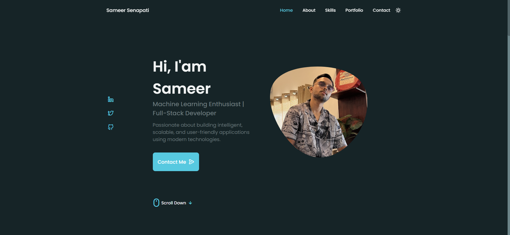

# Sameer Senapati Portfolio

Welcome to my personal portfolio website! This project showcases my skills, projects, and experience as a Machine Learning Enthusiast and Full-Stack Developer.

## 🚀 Features
- Responsive design for all devices
- Animated UI components
- Portfolio section with project demos
- Skills, qualifications, and contact form
- Dark/light theme toggle


## 🛠️ Built With
- HTML5 & CSS3
- JavaScript (ES6)
- [Swiper.js](https://swiperjs.com/) for portfolio carousel
- [Unicons](https://iconscout.com/unicons) for icons

## 📁 Project Structure
```
index.html
packages/
  css/
    styles.css
    swiper-bundle.min.css
  js/
    main.js
    swiper-bundle.min.js
  images/
    ... (profile and project images)
```

## 📸 Screenshots


## 📄 Usage
1. Clone the repository:
   ```sh
   git clone https://github.com/SameerSenapati17/Portfolio-WebsiteM.git
   ```
2. Open `index.html` in your browser.

## ✏️ Customization
- Update your information, images, and project details in `index.html` and the `images/` folder.
- Modify styles in `packages/css/styles.css` as needed.

## 📬 Contact
- **Email:** sameersenapati1709@gmail.com
- **LinkedIn:** [Sameer Senapati](https://www.linkedin.com/in/sameer-senapati-759b0528a/)

---
© Sameer Senapati. All rights reserved.
